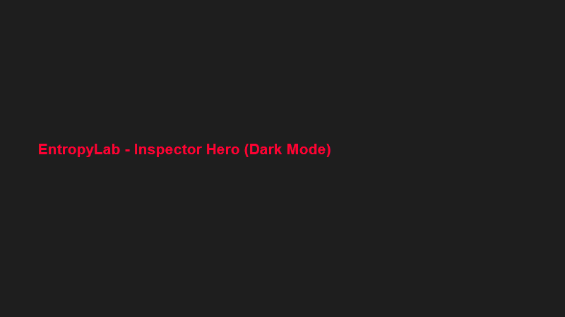
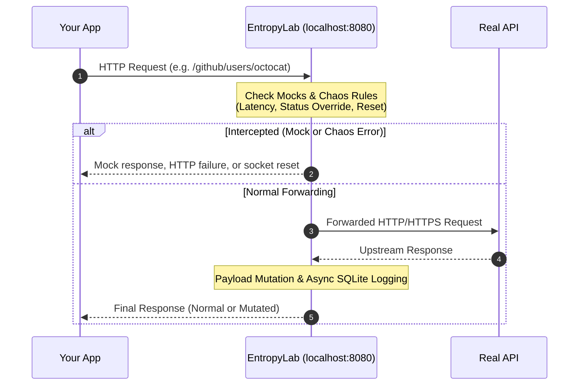
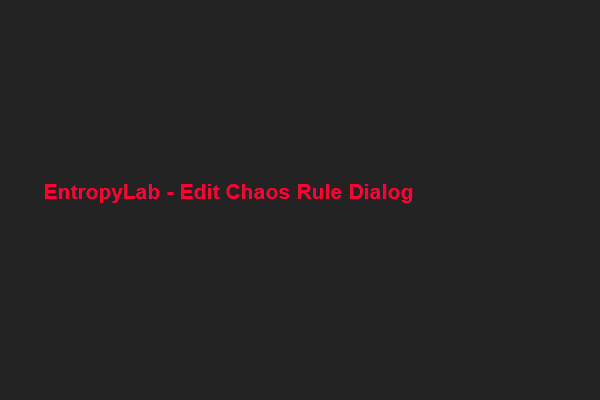
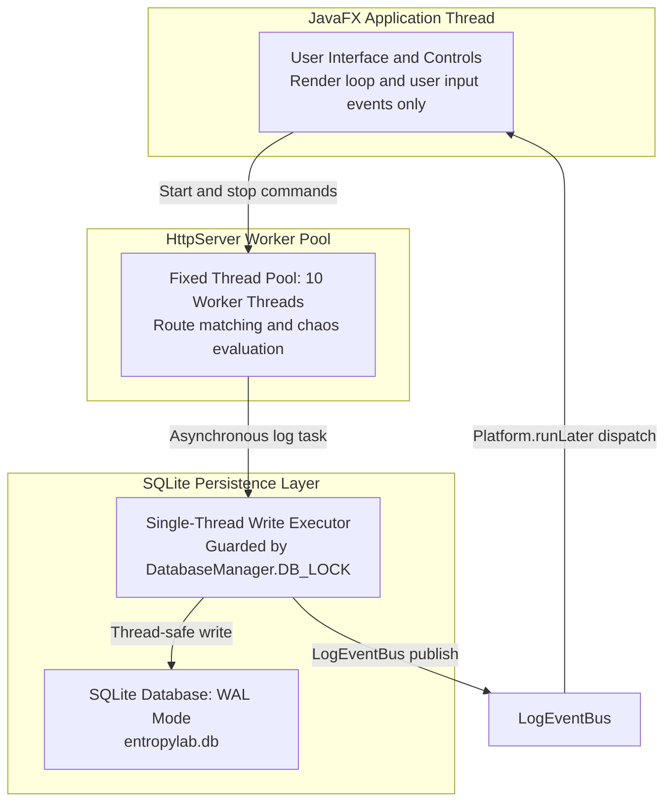
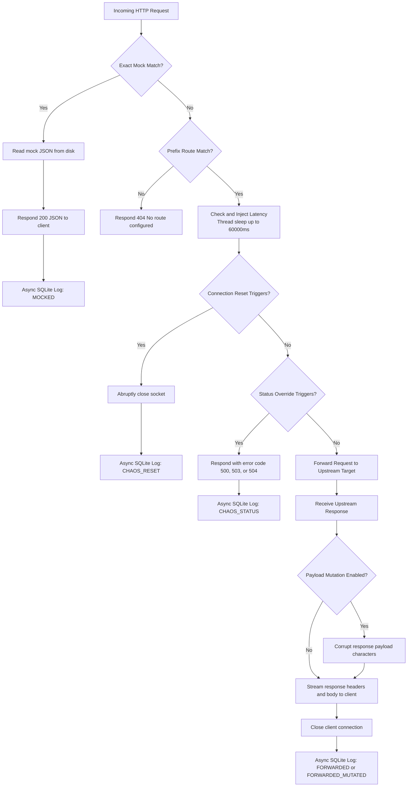

# EntropyLab

*A local reverse proxy that lets you break third-party APIs on purpose — so you can see how your app survives it.*




## Table of Contents

- [The Problem](#the-problem)
- [What EntropyLab Does](#what-entropylab-does)
- [Features](#features)
- [Quick Start (60 seconds)](#quick-start-60-seconds)
- [Architecture](#architecture)
- [Tech Stack](#tech-stack)
- [Build From Source](#build-from-source)
- [Packaging (Windows Installer)](#packaging-windows-installer)
- [Project Structure](#project-structure)
- [Documentation](#documentation)
- [Limitations & Roadmap](#limitations--roadmap)
- [License](#license)
- [Author](#author)

## The Problem

Modern applications rely heavily on external third-party APIs for authentication, payment processing, cloud services, and data ingestion. Despite this reliance, applications are rarely tested against slow responses, intermittent 500/503/504 errors, hard socket disconnections, or corrupted response payloads before shipping. Teams often discover how their user interface and retry logic behave during a third-party outage only when that outage occurs in production.

Existing tools for network fault injection and mocking often require complex command-line scripting, paid enterprise licenses, external cloud accounts, or intrusive system-wide network configuration. Setting up repeatable chaos testing for a local service should not require configuring heavy infrastructure or writing dedicated test stubs.

## What EntropyLab Does

EntropyLab runs as a local reverse proxy on your machine. Instead of configuring your application to call external APIs directly, you point it to a local endpoint (such as `http://localhost:8080/github`). EntropyLab receives incoming requests, matches them against configured prefix routes, and forwards them to target servers. On the way back—or before forwarding at all—EntropyLab can inject latency, override HTTP status codes, abruptly sever socket connections, corrupt payload characters, or serve saved mock responses directly from disk.



> **Warning: Reverse Proxy, Not a Transparent/MITM Proxy**
> EntropyLab is a **reverse proxy, not a transparent/MITM proxy**. It does not silently intercept outgoing HTTPS traffic sent to remote hosts. To inspect or disrupt traffic, you point your application or HTTP client directly to EntropyLab (for example, `http://localhost:8080/github/...`). If your code sends requests directly to an external endpoint, EntropyLab will not see or alter them. For more details on proxy architecture and edge cases, see [Limitations & FAQ](docs/07-troubleshooting/02-limitations-and-faq.md).

## Features

| Feature | What it does | Docs |
| :--- | :--- | :--- |
| Reverse Proxy Routing | Prefix-based HTTP request forwarding with longest-prefix path matching and query string preservation | [docs/01-proxy-and-routes/01-understanding-and-managing-routes.md](docs/01-proxy-and-routes/01-understanding-and-managing-routes.md) |
| Latency Injection | Configurable artificial delays from 0 to 60,000 ms to simulate slow networks and unresponsive dependencies | [docs/02-chaos-engine/02-latency-injection.md](docs/02-chaos-engine/02-latency-injection.md) |
| Status Code Override (500/503/504, probabilistic) | Forces HTTP server failure responses with configurable failure percentage (0–100%) | [docs/02-chaos-engine/03-status-code-override.md](docs/02-chaos-engine/03-status-code-override.md) |
| Connection Reset (hard socket close) | Abruptly terminates the client TCP connection with no HTTP response to simulate ungraceful crashes | [docs/02-chaos-engine/04-connection-reset.md](docs/02-chaos-engine/04-connection-reset.md) |
| Payload Mutation (character-level response corruption) | Randomly corrupts characters in successfully forwarded responses to stress-test client JSON parsing resilience | [docs/02-chaos-engine/06-payload-mutation.md](docs/02-chaos-engine/06-payload-mutation.md) |
| Sub-path Chaos Filtering | Restricts active chaos rules to specific sub-paths under a route while leaving all other endpoints untouched | [docs/02-chaos-engine/05-sub-path-filtering-and-combining-rules.md](docs/02-chaos-engine/05-sub-path-filtering-and-combining-rules.md) |
| Traffic Inspector (live, SQLite-backed, full history) | Displays recent traffic live with detailed header and body inspection backed by an asynchronous SQLite database | [docs/03-inspector/01-reading-and-using-traffic-history.md](docs/03-inspector/01-reading-and-using-traffic-history.md) |
| Auto-Mock Snapshot (one-click capture-to-mock) | Captures live inspected HTTP responses directly into static mock files on disk with a single click | [docs/03-inspector/02-inspecting-details-and-auto-mock.md](docs/03-inspector/02-inspecting-details-and-auto-mock.md) |
| Manual Static Mocks (with edit/delete) | Serves static JSON files for exact local paths with full support for creating, editing, and deleting mock mappings | [docs/04-mocking/01-manual-static-mocking.md](docs/04-mocking/01-manual-static-mocking.md) |
| Analytics Dashboard (error rate, p50/p95) | Computes aggregate performance metrics, failure rates, and p50/p95 duration across the entire traffic history | [docs/03-inspector/03-analytics-dashboard.md](docs/03-inspector/03-analytics-dashboard.md) |
| Light/Dark theme (persisted) | Dedicated dark and light UI palettes with theme preference persisted to local configuration across restarts | [docs/05-settings-and-data/01-theme-and-data-storage.md](docs/05-settings-and-data/01-theme-and-data-storage.md) |
| 100% local — no account, no cloud, no telemetry | Runs entirely on localhost with zero external dependencies, no user tracking, and all data kept on machine | [docs/00-orientation/01-welcome.md](docs/00-orientation/01-welcome.md) |



## Quick Start (60 seconds)

1. Launch EntropyLab on Windows.
2. In the **Routes** tab, click **Add Route**, enter `/github` for **Local Path** and `https://api.github.com` for **Target Base URL**, then click **Add**.
3. In the **Proxy Control** tab, verify **Port** is set to `8080` and click **Start Proxy** (the status label will turn green displaying **Running on port 8080**).
4. Open your web browser and navigate to `http://localhost:8080/github/users/octocat`.
5. Observe the live JSON response containing GitHub's Octocat profile returned through your local proxy.
6. Switch back to EntropyLab and click the **Inspector** tab to view the captured `GET` request logged with status `200` and type `FORWARDED`.
7. Double-click the request row to inspect full request and response headers along with pretty-printed JSON payloads.

For a comprehensive beginner walkthrough, see the [Quick Start Tutorial](docs/00-orientation/04-quick-start-tutorial.md). To begin injecting delays, server errors, and socket drops, explore the [How-To Recipes](docs/06-how-to-recipes/01-simulate-a-slow-api.md).

## Architecture

EntropyLab separates user interface rendering, HTTP network traffic, and local persistence across distinct execution tiers to keep the desktop window responsive under load and artificial latency.

### Threading Model



- **JavaFX Application Thread**: Dedicated exclusively to UI rendering, control state, and user interaction. Never handles blocking socket operations, external HTTP calls, or disk I/O.
- **Embedded HTTP Server Worker Pool**: Managed by `ProxyServerManager`, which allocates a fixed thread pool of 10 worker threads (`Executors.newFixedThreadPool(10)`) to `com.sun.net.httpserver.HttpServer`. Incoming client requests execute concurrently on separate worker threads without blocking one another.
- **Single-Thread SQLite Write Executor**: `RequestLogDAO` dispatches database writes to a dedicated single-thread executor (`Executors.newSingleThreadExecutor()`). This serializes all log insertions asynchronously without blocking HTTP worker threads or delaying client responses.
- **Thread-Safe Database Synchronization**: All database operations share a single connection guarded by `DatabaseManager.DB_LOCK` with SQLite configured in Write-Ahead Logging mode (`PRAGMA journal_mode=WAL;`), enabling concurrent reads while writes are serialized.
- **Asynchronous UI Dispatch**: Background worker and database threads notify the user interface through `LogEventBus` using `Platform.runLater()`. Because request processing and artificial delays execute entirely on worker threads, an injected 60-second delay cannot freeze the application window.

### Request Lifecycle



Logging occurs strictly *after* the client connection is closed and the response is fully delivered, guaranteeing that SQLite database writes and JSON serialization never introduce artificial latency into the client's measured round-trip time.

### Persistence & Data Layout

EntropyLab stores all local state, traffic logs, and mock data under `%APPDATA%\EntropyLab`:

| Path | Type | Contents & Purpose |
| :--- | :--- | :--- |
| `%APPDATA%\EntropyLab\config.json` | JSON File | Application settings, route mappings, chaos rules, active theme, and mock registrations |
| `%APPDATA%\EntropyLab\entropylab.db` | SQLite Database | Complete HTTP request and response history stored in WAL mode for inspection and analytics |
| `%APPDATA%\EntropyLab\mocks\` | Directory | Saved static JSON response files created manually or snapshot via the Inspector |

If `config.json` is missing or corrupted by invalid syntax, `ConfigManager.load()` catches the parsing exception, instantiates a clean default `AppConfig`, immediately persists it, and wraps route mappings, chaos rules, and mock mappings into `CopyOnWriteArrayList` collections to maintain thread safety across concurrent proxy worker threads.

For full details on data storage directories and configuration persistence, see [Theme & Data Storage](docs/05-settings-and-data/01-theme-and-data-storage.md).

## Tech Stack

| Layer | Technology | Why |
| :--- | :--- | :--- |
| Language | Java 17 LTS (compiler release 17) | Stable LTS baseline with native HTTP client and modern concurrency primitives |
| Desktop UI | JavaFX 21.0.2 (`javafx-controls`) | Hardware-accelerated desktop UI framework with decoupled CSS stylesheets |
| Embedded Server | `com.sun.net.httpserver.HttpServer` (JDK 17 built-in) | Lightweight HTTP server with zero external dependencies shipping with the JDK |
| Outbound Client | `java.net.http.HttpClient` (JDK 17 built-in) | Native HTTP/1.1 and HTTP/2 client with configurable body publishers and handlers |
| Local Storage | SQLite JDBC 3.46.1.0 (Xerial, WAL mode) | Serverless, zero-configuration embedded relational storage with Write-Ahead Logging |
| Native Integration | JNA Platform 5.14.0 (`jna-platform`) | Access to Windows DWM APIs for native window snapping, styling, and frame borders |
| JSON Serialization | FasterXML Jackson 2.17.2 (`jackson-databind`) | Fast, battle-tested JSON serialization for configuration files, mocks, and traffic payloads |
| Build Tool | Apache Maven (Compiler 3.13.0, JavaFX 0.0.8) | Reproducible multi-platform dependency resolution and lifecycle management |
| Application Packaging | JDK `jpackage` (via WiX Toolset 3.11) | Bundles a self-contained runtime into a Windows MSI installer requiring no pre-installed JDK |

## Build From Source

### Prerequisites

- **Java Development Kit (JDK)**: Version 17 or higher
- **Apache Maven**: Version 3.8 or higher
- **Git**

### Clone & Run

```bash
git clone https://github.com/entropylab/entropylab.git
cd entropylab
mvn javafx:run
```

The application runs on the standard Java classpath without a `module-info.java` descriptor, deliberately avoiding Java Module System (JPMS) illegal reflection barriers and modular encapsulation constraints across SQLite JDBC, JNA, and Jackson Databind.

> **Note: Where data goes when running from source**
> When running from source, EntropyLab writes configuration and database files to `%APPDATA%\EntropyLab` (typically `C:\Users\<Username>\AppData\Roaming\EntropyLab`). If the `APPDATA` environment variable is not defined or is blank, the application falls back to `~/.entropylab` in your user home directory.

## Packaging (Windows Installer)

EntropyLab uses JDK `jpackage` to produce a standalone Windows MSI installer bundled with a dedicated Java runtime image.

### Building the Installer

Run the Maven `installer` profile:

```bash
mvn package -Pinstaller
```

Under the hood, this triggers `package.ps1`, which gathers runtime dependencies into `target/package-input`, isolates modular JavaFX JARs in `target/javafx-mods`, and invokes `jpackage`:

```powershell
jpackage `
  --type msi `
  --dest target/installer `
  --name EntropyLab `
  --app-version 1.0.0 `
  --vendor "Abdur Rahman" `
  --description "EntropyLab - Reverse Proxy & Chaos Engineering Lab" `
  --input target/package-input `
  --main-jar entropylab-1.0.0-SNAPSHOT.jar `
  --main-class com.entropylab.Main `
  --module-path target/javafx-mods `
  --add-modules javafx.controls,jdk.httpserver,java.net.http,java.sql,java.desktop,java.naming,jdk.unsupported,java.xml,jdk.crypto.ec,jdk.crypto.mscapi `
  --icon src/main/resources/com/entropylab/branding/EntropyLab.ico `
  --win-menu `
  --win-menu-group EntropyLab `
  --win-shortcut `
  --win-shortcut-prompt `
  --win-dir-chooser `
  --win-upgrade-uuid 3f98c4c2-9b2e-4e89-a291-76a08696ecde
```

Output is generated in `target/installer/` (producing `EntropyLab-1.0.0.msi` when WiX Toolset 3.11 is present on `PATH`, or a standalone `app-image` directory as fallback). Because the installer bundles a customized Java runtime image, end users do not need a JDK or JRE pre-installed on their machine.

## Project Structure

```text
EntropyLab/
├── src/main/java/com/entropylab/
│   ├── config/            # Configuration model, file resolution, and corrupt-config recovery
│   │   ├── AppConfig.java
│   │   ├── AppPaths.java
│   │   └── ConfigManager.java
│   ├── db/                # SQLite connection lifecycle, WAL pragma, and async request logging
│   │   ├── DatabaseManager.java
│   │   └── RequestLogDAO.java
│   ├── model/             # Domain entities for routes, chaos rules, mocks, and logged traffic
│   │   ├── ChaosRule.java
│   │   ├── MockMapping.java
│   │   ├── RequestLogEntry.java
│   │   └── RouteMapping.java
│   ├── proxy/             # Reverse proxy server, route matching, chaos engine, and payload mutation
│   │   ├── ChaosEngine.java
│   │   ├── ProxyRequestHandler.java
│   │   └── ProxyServerManager.java
│   ├── ui/                # JavaFX tab views, custom title bar, themes, and native Windows snapping
│   │   ├── AboutView.java
│   │   ├── AnalyticsView.java
│   │   ├── ChaosRulesView.java
│   │   ├── CustomTitleBar.java
│   │   ├── InspectorView.java
│   │   ├── MockManagementView.java
│   │   ├── ProxyControlView.java
│   │   ├── RouteMappingView.java
│   │   ├── SubWindowHelper.java
│   │   ├── ThemeManager.java
│   │   ├── WindowResizeHelper.java
│   │   └── WindowsSnapHelper.java
│   ├── util/              # Event dispatch bus, path normalization, branding, and environment utils
│   │   ├── AppBrandUtil.java
│   │   ├── EnvUtil.java
│   │   ├── LogEventBus.java
│   │   └── PathUtil.java
│   └── Main.java          # Application entry point and JavaFX stage lifecycle
├── src/main/resources/
│   └── com/entropylab/
│       ├── branding/      # Application logo, window icons, and profile image
│       └── styles/        # JavaFX CSS stylesheets (dark-theme.css, light-theme.css)
└── docs/                  # Diátaxis user documentation (tutorials, how-to recipes, reference, explanation)
```

## Documentation

The complete user manual is available in the [User Manual & Master Index](docs/00-MANUAL-INDEX.md), structured according to the Diátaxis documentation framework (tutorials, how-to guides, reference, and explanation).

Choose your starting point based on your experience and current objective:

- **New to API testing?** → Start at [Orientation](docs/00-orientation/01-welcome.md) to understand core concepts and follow the step-by-step [Quick Start Tutorial](docs/00-orientation/04-quick-start-tutorial.md).
- **Know APIs, new to chaos?** → Jump straight to [How-To Recipes](docs/06-how-to-recipes/01-simulate-a-slow-api.md) to simulate slow networks, intermittent outages, or abrupt socket crashes.
- **Need a quick fact?** → Look up field ranges, port bounds, and defaults in the [Complete UI Field Reference](docs/08-reference/02-complete-ui-field-reference.md) or consult the [Glossary of Terms](docs/08-reference/01-glossary.md).

## Limitations & Roadmap

### Current Limitations (v1.1.0)

- **Reverse proxy only**: Operates strictly as a reverse proxy where clients connect to `localhost:<port>`. Does not perform transparent HTTPS/TLS interception (MITM) of arbitrary outbound system traffic.
- **Windows only**: Window management, title bar snapping, and packaging are built specifically for Windows 10 and 11.
- **No request replay or editing**: Requests can be inspected and saved as static mocks, but cannot be modified in-flight or re-sent from the UI.
- **No collections or environment variables**: Route mappings and chaos rules are managed in dedicated tables rather than nested Postman-style collections or variable scopes.

### Roadmap

- Transparent MITM proxying with local Certificate Authority (CA) installation
- Native cross-platform desktop builds for macOS and Linux
- Request replay and ad-hoc request editing directly within the Traffic Inspector

## License

License: to be determined.

An MIT open-source license file will be added to the repository root.

## Author

EntropyLab was created by **Abdur Rahman** — [GitHub](https://github.com/AR-Fahim) • [LinkedIn](https://linkedin.com/) • [Portfolio](https://example.com)
