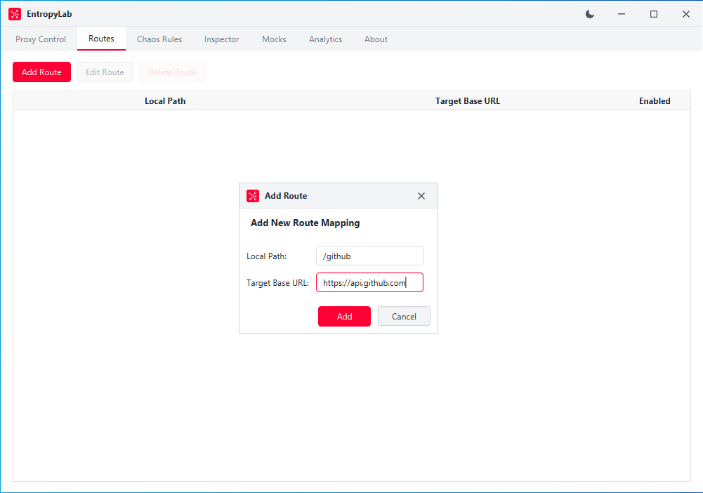
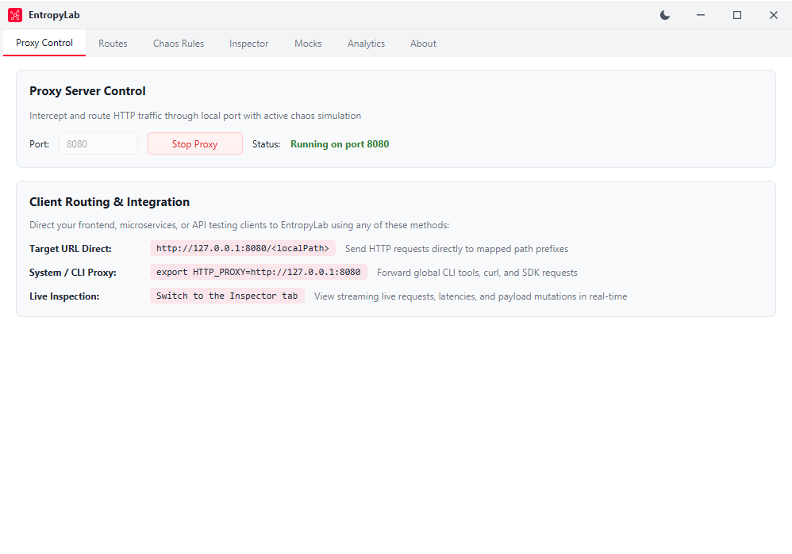
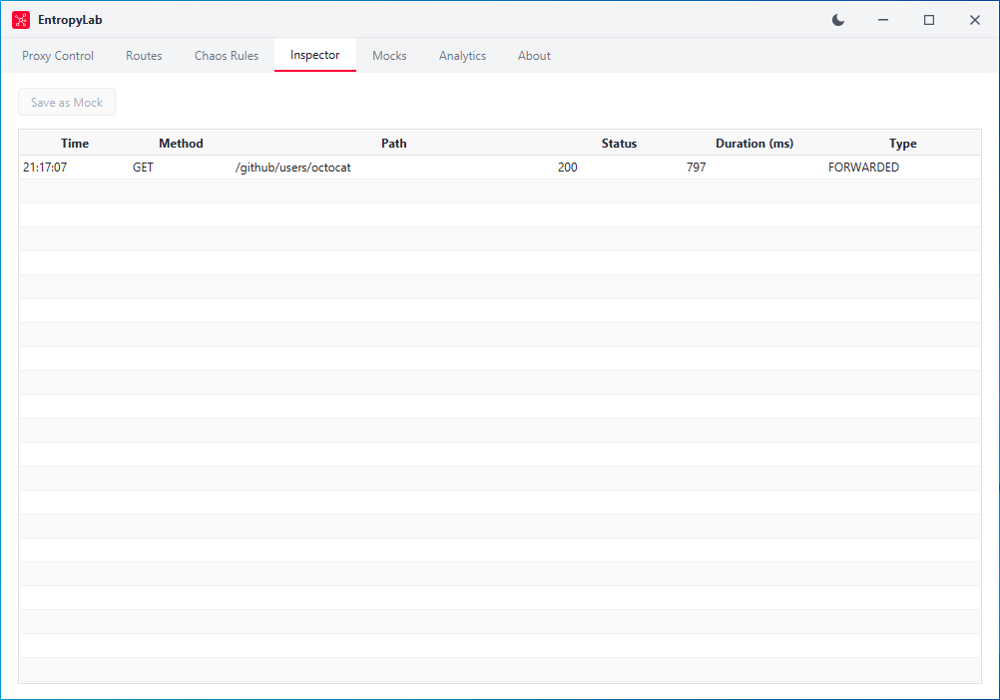

# Quick Start Tutorial: Your First Route & Inspected Request
*For: complete beginners*

## What You'll Learn

In this tutorial, you will take your very first hands-on steps with EntropyLab. By the time you finish, you will know how to:

- Create a route mapping that connects a local path to an external internet API.
- Start the EntropyLab reverse proxy engine on your computer.
- Send a live web request through the proxy using your standard web browser.
- Inspect the captured request and its formatted JSON response inside the Traffic Inspector.

You do not need any coding experience, terminal commands, or prior API knowledge to complete this walkthrough.

## Before You Begin

Before starting, ensure that:
1. You have installed and launched EntropyLab on Windows as described in [Installation and First Launch](./03-installation-and-first-launch.md).
2. The EntropyLab main window is open in front of you.
3. Your computer has an active internet connection so EntropyLab can reach GitHub's public API.

---

## Step-by-Step Walkthrough

### Step 1: Create Your First Route Mapping

A route tells EntropyLab where to send traffic when a request arrives. We will connect the local path `/github` to GitHub's official public API (`https://api.github.com`).

1. In the top navigation bar of EntropyLab, click the **Routes** tab.
2. In the toolbar above the empty table, click the **Add Route** button. A dialog window titled **Add Route** will appear.
3. In the **Local Path** field, type:
   ```text
   /github
   ```
   *Why this matters:* This is the local prefix EntropyLab will listen for. Any request starting with `/github` will be captured by this rule.
4. In the **Target Base URL** field, type:
   ```text
   https://api.github.com
   ```
   *Why this matters:* This is the real internet address where EntropyLab should forward your requests.
5. Click the **Add** button at the bottom of the dialog.



You will now see a new row in your **Routes** table showing:
- **Local Path**: `/github`
- **Target Base URL**: `https://api.github.com`
- **Enabled**: Checked (active)

---

### Step 2: Start the Proxy Engine

Now that EntropyLab knows where to forward `/github` traffic, you need to turn on the proxy engine so it begins listening for requests.

1. In the top navigation bar, click the **Proxy Control** tab.
2. Notice the **Port** field is already set to `8080`. Leave this value as `8080`.
   *Why this matters:* Port `8080` is standard for local web proxies and works seamlessly for web browsers without conflicting with standard system ports.
3. Click the **Start Proxy** button.
4. Look at the **Status** label directly below the button. The label will change from red **Stopped** to bold green:
   ```text
   Running on port 8080
   ```



Your proxy is now actively listening for traffic on your machine.

---

### Step 3: Send a Live Request Through the Proxy

Now let's test the proxy by requesting public user profile information for GitHub's mascot, `octocat`.

1. Open your everyday web browser (Google Chrome, Microsoft Edge, or Mozilla Firefox).
2. Click the address bar at the top of your browser, type the following exact URL, and press **Enter**:
   ```text
   http://localhost:8080/github/users/octocat
   ```
3. Look at your browser screen. Within a second, you will see a raw JSON response directly from GitHub:
   ```json
   {
     "login": "octocat",
     "id": 583231,
     "name": "The Octocat",
     "company": "@github",
     "blog": "https://github.blog",
     "location": "San Francisco",
     ...
   }
   ```

> **Tip:** Why is this exciting? You did not contact `api.github.com` directly. You contacted your own local computer on port 8080 (`localhost:8080`). EntropyLab received your browser's request, saw the `/github` prefix, stripped it, reached out across the real internet to `https://api.github.com/users/octocat`, collected GitHub's answer, and delivered it back to your browser window. You just routed live internet traffic through your own local reverse proxy!

---

### Step 4: Locate the Request in the Traffic Inspector

Now let's verify that EntropyLab recorded this transaction.

1. Switch back to the **EntropyLab** desktop window.
2. In the top navigation bar, click the **Inspector** tab.
3. Look at the table. A new row has appeared at the top of the list representing your browser request.

Here is a quick overview of what each column shows:
- **Time**: The exact time of day your request reached EntropyLab (e.g., `14:22:05`).
- **Method**: The HTTP verb used (`GET`, which means retrieving data).
- **Path**: The local path requested (`/github/users/octocat`).
- **Status**: The HTTP response code returned by GitHub (`200`, meaning Success).
- **Duration (ms)**: The total round-trip time in milliseconds it took to contact GitHub and receive the data.
- **Type**: Displays `FORWARDED`, confirming this request was relayed to a real external server rather than intercepted by a mock or chaos rule.



---

### Step 5: Inspect the Request and Response Payloads

1. In the Inspector table, **double-click** the row you just created (or select it and press Enter).
2. A detailed inspection window titled **Request Details** opens, divided into a clear grid:
   - **Request Headers**: The metadata headers your web browser sent.
   - **Response Headers**: The headers GitHub's web servers returned (such as content type and server date).
   - **Request Body**: Empty, because standard browser `GET` requests do not send an upload body.
   - **Response Body**: The complete, pretty-printed JSON payload received from GitHub, formatted neatly with syntax indentation.
3. Click the **Close** button at the bottom right when you are finished reviewing the data.

---

## What You Just Learned

Congratulations! In less than five minutes, you have mastered the foundational building blocks of EntropyLab:

1. **Created a Route**: You mapped an incoming local path (`/github`) to an external target base URL (`https://api.github.com`).
2. **Started the Proxy Engine**: You launched the reverse proxy on port `8080`.
3. **Relayed Live Traffic**: You sent an HTTP request from your browser through `localhost:8080` to a live remote service.
4. **Inspected Network Payloads**: You observed the live transaction in the **Inspector** tab and examined its pretty-printed JSON payload.

---

## Next Steps

Now that you know how traffic flows through EntropyLab when everything works normally, you are ready to explore advanced features and start breaking things on purpose:

- **Master Route Rules (Module B)**: Learn how longest-prefix matching works, how query strings are forwarded, and how to manage multiple routes in [Understanding & Managing Routes](../01-proxy-and-routes/01-understanding-and-managing-routes.md).
- **Start Breaking Things with the Chaos Engine (Module C)**: Learn how to inject delays, return 500 errors, or simulate abrupt socket crashes in [What Is Chaos Engineering?](../02-chaos-engine/01-what-is-chaos-engineering.md).
- **Simulate Your First Slow API**: Jump straight into a practical recipe to see how your browser handles high latency in [Simulate a Slow API](../06-how-to-recipes/01-simulate-a-slow-api.md).

---

## Related Reading

- [Welcome to EntropyLab](./01-welcome.md)
- [Core Concepts: How Reverse Proxies & Chaos Work](./02-core-concepts.md)
- [Understanding & Managing Routes](../01-proxy-and-routes/01-understanding-and-managing-routes.md)
- [Proxy Control Reference](../01-proxy-and-routes/02-proxy-control.md)
- [Reading & Using Traffic History](../03-inspector/01-reading-and-using-traffic-history.md)
