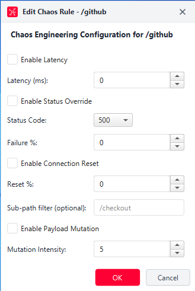

# Sub-Path Filtering & Combining Chaos Rules
*For: intermediate and advanced developers configuring targeted chaos rules and compound failure scenarios.*

## Overview

By default, an active chaos rule applies to all traffic passing through its associated route. However, real-world systems rarely fail everywhere simultaneously. Often, read endpoints (such as `/products` or `/health`) remain fast and reliable, while a write-heavy or payment-specific endpoint (such as `/checkout` or `/charge`) suffers latency or crashes.

The **Sub-path filter** feature enables you to isolate chaos injection to a specific nested endpoint underneath a route. Furthermore, EntropyLab allows you to combine multiple chaos features simultaneously according to a strict, deterministic execution order.

> **Note:** For individual reference on specific chaos tools, see [Latency Injection](./02-latency-injection.md), [Status Code Override](./03-status-code-override.md), and [Connection Reset](./04-connection-reset.md).

## The Sub-Path Filter at a Glance

The **Sub-path filter (optional)** input is located directly beneath the Connection Reset controls in the **Edit Chaos Rule** dialog.



When populated, the filter scopes **all three chaos features** (latency, status override, and connection reset) exclusively to request paths that match the specified sub-path. Requests matching the parent route but targeting different sub-paths bypass all chaos rules and forward directly to the real API.

### Worked Example: Scoping Chaos to `/checkout`

Imagine you have configured a route for a payment provider:
- **Local Path**: `/stripe`
- **Target Base URL**: `https://api.stripe.com`

You configure a chaos rule with **Latency (ms)** set to `3000` and the **Sub-path filter** set to `/checkout`.

Here is how incoming requests are evaluated:

| Incoming Request Path | Matches Route? | Matches Sub-Path Filter? | Applied Behavior |
|---|---|---|---|
| `http://localhost:8080/stripe/checkout` | Yes (`/stripe`) | **Yes** (`/checkout`) | **3,000 ms delay injected**, then forwarded. |
| `http://localhost:8080/stripe/checkout/pay` | Yes (`/stripe`) | **Yes** (`/checkout/...`) | **3,000 ms delay injected**, then forwarded. |
| `http://localhost:8080/stripe/status` | Yes (`/stripe`) | **No** | **Zero delay**. Forwards instantly to `https://api.stripe.com/status`. |
| `http://localhost:8080/stripe/customers` | Yes (`/stripe`) | **No** | **Zero delay**. Forwards instantly to `https://api.stripe.com/customers`. |

## Step-by-Step: Scoping Chaos to a Sub-Path

1. Open the **Chaos Rules** tab.
2. Select the parent route you wish to target (e.g., `/stripe`) and click **Edit Chaos Rule**.
3. Configure your desired chaos features (such as enabling Latency or Status Code Override).
4. Locate the **Sub-path filter (optional)** text field.
5. Enter the sub-path prefix you wish to target (e.g., `/checkout` or `checkout`).
6. Click **OK** to save the rule.

The rule takes effect immediately. In the **Chaos Rules** table, your chaos summary reflects the active settings.

## Field-by-Field Reference

| Field / Control | What it does | Valid values / format | Default |
|---|---|---|---|
| **Sub-path filter (optional)** | Restricts all active chaos features on this route so they only trigger if the incoming path matches this sub-path suffix. | Text string (e.g., `/checkout` or `/api/v2`). Leading slash is optional (automatically normalized). If left blank, chaos applies to the entire route. | Blank (applies to whole route) |

---

## How Rules Combine: Execution Order & Stacking

When you enable multiple chaos capabilities on the same route, EntropyLab processes incoming requests through a strict, deterministic sequence:

**Mock check → Route match → Latency → Connection Reset → Status Override → Real forward → Payload Mutation (only if the forward succeeded)**

### The Execution Pipeline

Every request arriving at EntropyLab traverses the following pipeline in order:

```text
Incoming Request on localhost:8080
                 │
                 ▼
       [ 1. Mock Check ] ──────────(Exact Match?)──────────► [ Return Mock Payload ]
                 │ No
                 ▼
       [ 2. Route Match ] ─────────(No Route?)─────────────► [ Return 404 Not Found ]
                 │ Found
                 ▼
   [ 3. Sub-Path Filter Check ] ───(Does Not Match?)───────► [ Forward to Real API ]
                 │ Matches Filter (or Filter is blank)
                 ▼
      [ 4. Latency Injection ] ────(Enabled?)──────────────► [ Sleep for configured ms ]
                 │
                 ▼
      [ 5. Connection Reset ] ─────(Roll < Reset %?)───────► [ Abruptly Close Socket ] (Terminates!)
                 │ Did not trigger
                 ▼
     [ 6. Status Override ] ───────(Roll < Failure %?)─────► [ Return 500/503/504 ] (Terminates!)
                 │ Did not trigger
                 ▼
   [ 7. Forward to Real API ] ─────────────────────────────► [ Fetch Real Upstream Response ]
                 │ Response received successfully
                 ▼
    [ 8. Payload Mutation ] ───────(Enabled?)──────────────► [ Scramble chars in body ] ──► [ Deliver to Client (FORWARDED_MUTATED) ]
                 │ Disabled
                 ▼
   [ Deliver Clean Response ] ─────────────────────────────► [ Deliver to Client (FORWARDED) ]
```

> [!NOTE]
> **Sub-path Filter Gates All Four Chaos Features:**
> Just as with Latency, Connection Reset, and Status Code Override, **Sub-path Filtering also gates Payload Mutation**. When an optional sub-path filter is set, only requests matching the sub-path undergo payload mutation. Non-matching sub-paths under the same route pass through completely uncorrupted with their original upstream payload.

> **For Experts:** If both **Connection Reset** and **Status Code Override** are enabled and both roll a triggering probability on the same request, **Connection Reset always wins**. The connection socket is severed immediately. Status Code Override never gets a chance to run, and no HTTP status code or header is ever transmitted. Furthermore, **Payload Mutation requires a real upstream response**; if either Connection Reset or Status Code Override triggers, the real API is never called and mutation is skipped entirely.

### Worked Example 1: Latency (100%) + Status Override (30%)

Suppose a route is configured with:
- **Enable Latency**: Checked (`2000 ms`)
- **Enable Status Override**: Checked (Status `500`, Failure % `30%`)

**How this behaves in practice:**
1. **Latency runs first**: **Every single matching request** is held for 2,000 milliseconds. Latency is always applied first regardless of the outcome of subsequent checks.
2. **Failure probability evaluates second**: After the 2,000 ms delay completes, EntropyLab rolls the dice for the 30% failure rate:
   - **~30% of requests**: Return HTTP `500 Internal Server Error (Chaos Override)`.
   - **~70% of requests**: Forward to the real upstream API and return the real response.

*Key Takeaway:* Latency and failure probability stack independently. You successfully simulate a slow API where 30% of the slow calls ultimately fail.

### Worked Example 2: Tri-Feature Compound Chaos

Suppose you configure all three network/status features simultaneously on `/github`:
- **Latency**: `1500 ms` (Enabled)
- **Connection Reset**: `20%` (Enabled)
- **Status Override**: Status `503`, `50%` (Enabled)

When 100 requests arrive at this endpoint, here is the predicted distribution:
1. **100 of 100 requests** experience the 1,500 ms delay.
2. **~20 requests (20%)**: Trigger **Connection Reset**. Their connections are abruptly terminated. Their request lifecycle ends immediately.
3. **~80 requests**: Survive the reset check. They now evaluate the 50% Status Override check:
   - **~40 requests (50% of 80)**: Return HTTP `503 Service Unavailable (Chaos Override)`.
   - **~40 requests (remaining 50%)**: Forward cleanly to the real GitHub API and return live data.

### Worked Example 3: Delayed + Corrupted Responses (Latency + Payload Mutation)

Suppose you configure a route with:
- **Enable Latency**: Checked (`2000 ms`)
- **Enable Payload Mutation**: Checked (Intensity `10` characters)
- **Status Override**: Unchecked / OFF
- **Connection Reset**: Unchecked / OFF

**How this behaves in practice:**
1. **Latency runs first**: Every matching request is held for 2,000 milliseconds.
2. **Failure checks pass**: Because Connection Reset and Status Code Override are both disabled, the request proceeds to the real upstream API.
3. **Upstream response arrives**: The target API returns its successful HTTP 200 response.
4. **Payload Mutation runs as the final step**: EntropyLab randomly corrupts 10 characters within the real response body before sending it back to your client.
5. **Inspector logged as `FORWARDED_MUTATED`**: The request duration reflects the 2,000 ms delay plus network transit time, and the response body in the detail view contains visibly corrupted data.

*Key Takeaway:* Because neither Connection Reset nor Status Override intervened to abort or replace the request, every matching request is delayed **AND** delivered with its real response corrupted.

## Common Mistakes & Troubleshooting

- **Expecting Status Overrides When Reset % Is 100%**: If **Reset %** is set to `100%`, Connection Reset will trigger on every single request. Status Code Override will never execute because the socket closes before headers can be sent.
- **Expecting Payload Mutation on Broken Requests**: Payload mutation cannot corrupt a response that never happened. If a request terminates early via Connection Reset or Status Code Override, no mutation takes place.
- **Accidental Sub-Path Mismatches**: If you enter a sub-path filter of `/v1/checkout`, but your application calls `http://localhost:8080/stripe/checkout` (omitting `/v1`), the filter will not match, and no chaos (latency, resets, overrides, or mutations) will be injected. Always check the **Inspector** tab to confirm the incoming path structure.
- **Mocks Bypass Chaos Completely**: If an exact path mock exists in the **Mocks** tab, it takes precedence at Step 1 of the pipeline. Chaos rules (including latency, errors, and mutations) are never evaluated for mocked endpoints.

## Related Reading

- [What Is Chaos Engineering?](./01-what-is-chaos-engineering.md)
- [Latency Injection Reference](./02-latency-injection.md)
- [Status Code Override Reference](./03-status-code-override.md)
- [Connection Reset Reference](./04-connection-reset.md)
- [Payload Mutation Reference](./06-payload-mutation.md)
- [How-To Recipe: Scope Chaos to One Endpoint](../06-how-to-recipes/07-scope-chaos-to-one-endpoint.md)
- [How-To Recipe: Combine Latency and Failure](../06-how-to-recipes/04-combine-latency-and-failure.md)
- [How-To Recipe: Test Malformed JSON Resilience](../06-how-to-recipes/09-test-malformed-json-resilience.md)
